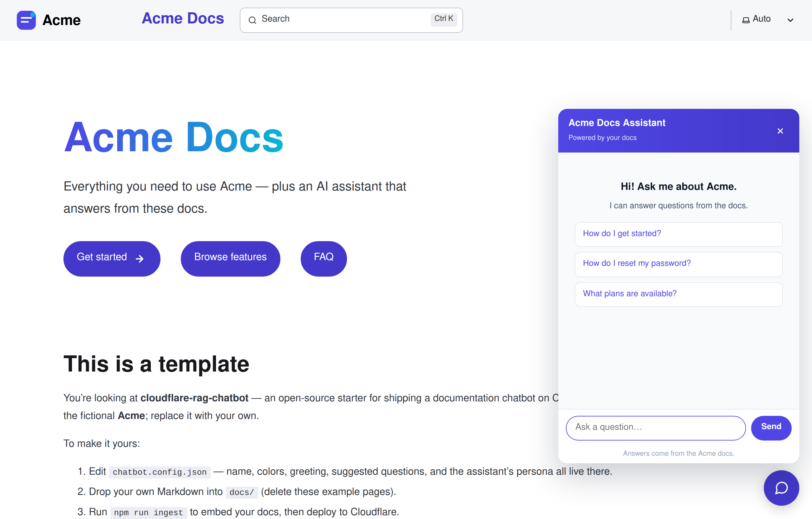
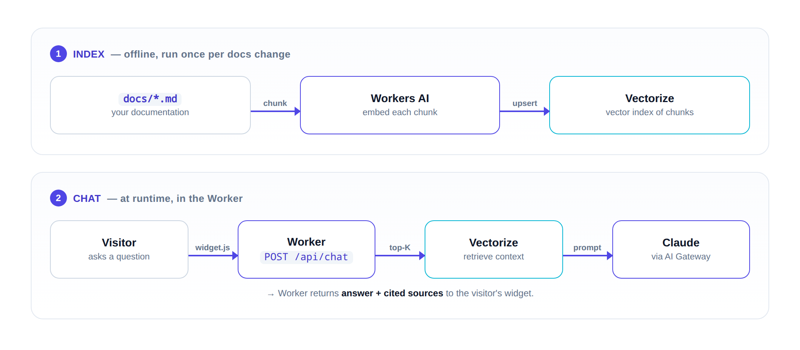

# cloudflare-rag-chatbot

A drop-in **RAG (retrieval-augmented generation) chatbot for your docs**, running entirely
on Cloudflare. Put your Markdown in `docs/`, edit one config file, deploy — and every page
gets an embeddable AI chat widget that answers **only from your documentation, with
citations**.

Built with [Astro Starlight](https://starlight.astro.build/) for the docs site and a single
[Cloudflare Worker](https://developers.cloudflare.com/workers/) for the chat API + static
assets. The example brand is the fictional **Acme** — replace it with your own.



> **Use this template** → click **Use this template** on GitHub (or fork it), then follow
> the quickstart below.

## How it works



1. **Ingest** (`npm run ingest`): walks `docs/**/*.{md,mdx}`, chunks each page, embeds the
   chunks with **Workers AI** (`@cf/baai/bge-large-en-v1.5`), and upserts them into
   **Cloudflare Vectorize**.
2. **Chat** (in the Worker): an incoming `/api/chat` request embeds the question, queries
   Vectorize for the top-K chunks, builds a grounded prompt, and answers with **Claude via
   Cloudflare AI Gateway** (unified billing — no Anthropic key needed).

## Make it yours

Everything brand-specific lives in **one file: `chatbot.config.json`**.

```jsonc
{
  "brand":  { "name": "Acme", "assistantName": "Acme Docs Assistant",
              "description": "Help docs for Acme.", "siteUrl": "https://example.com" },
  "widget": { "greeting": "Hi! Ask me about Acme.", "footer": "Answers come from the Acme docs.",
              "suggestedQuestions": ["How do I get started?", "..."] },
  "prompt": { "persona": "You are the Acme Docs Assistant — ...",
              "audience": "You answer questions from Acme users.",
              "offTopicLabel": "Acme topics", "fallbackHint": "contact support" },
  "colors": { "primary": "#4f46e5", "primaryDark": "#4338ca", "accent": "#06b6d4",
              "accentLight": "#a5b4fc", "darkSurface": "#0b1020" }
}
```

- `brand` / `widget` / `prompt` — names, greeting, suggested questions, and the assistant's
  persona (system prompt).
- `colors` — the full palette for both the docs site and the chat widget.

A small build step (`scripts/gen-brand.mjs`, run automatically before `dev`/`build`) reads
this file and generates `public/widget-config.js` and `src/styles/brand-tokens.css`. The
Astro config and the Worker prompt import the JSON directly, so **the config is the single
source of truth.**

Then:

1. Replace the example pages in `docs/` with your own Markdown (folder names become sidebar
   groups — see `astro.config.mjs`).
2. Swap `public/logo.svg` and `public/favicon.svg` for your brand.
3. Set the infra names in `wrangler.jsonc` (worker name, Vectorize index, AI Gateway).

## Local development

```bash
npm install
npm run dev      # http://localhost:4321  (regenerates brand assets first)
```

The chat widget needs the deployed backend (Vectorize + AI Gateway). For a full local test
of the chat API, build and run the Worker:

```bash
npm run build              # outputs to dist/ (runs the brand generator first)
npx wrangler dev           # serves the Worker + static assets

curl http://localhost:8788/api/health        # → { "ok": true }
curl -X POST http://localhost:8788/api/chat \
     -H 'content-type: application/json' \
     -d '{"message":"How do I get started?"}'
```

Open `http://localhost:8788/` — the chat bubble appears bottom-right on every page.

## One-time Cloudflare setup

The chat path uses **Cloudflare AI Gateway with unified billing**: Cloudflare proxies the
Anthropic call with their managed credentials and bills your CF account, so the Worker never
sees an Anthropic API key.

```bash
# 1. Create the Vectorize index (1024-dim, cosine). Name must match wrangler.jsonc.
npx wrangler vectorize create cloudflare-rag-chatbot --dimensions=1024 --metric=cosine

# 2. Create an AI Gateway:
#    Dashboard → AI → AI Gateway → Create gateway → name: cloudflare-rag-chatbot
#    Put that name in wrangler.jsonc → vars.AI_GATEWAY_NAME, and your account ID in
#    vars.AI_GATEWAY_ACCOUNT.

# 3. Enable unified billing for Anthropic on that gateway:
#    Gateway → Provider keys → Anthropic → toggle "Unified billing".
#    Confirm a payment method is on file under Billing.

# 4. Create an AI Gateway authentication token, then store it as a Worker secret:
#    Dashboard → My Profile → API Tokens → Create Token → AI Gateway: Run.
npx wrangler secret put CF_AIG_TOKEN

# 5. Create a second API token for the ingest script
#    (Workers AI: Read + Vectorize: Edit) and save it to .env (see .env.example).
```

## Index your docs

```bash
cp .env.example .env
# edit .env: set CLOUDFLARE_ACCOUNT_ID and CLOUDFLARE_API_TOKEN
npm run ingest                 # embed + upsert every chunk (idempotent — re-run any time)
npm run ingest -- --dry-run    # chunk only; don't embed or upload
```

To remove vectors for a deleted page, find its chunk ids and run
`npx wrangler vectorize delete-vectors cloudflare-rag-chatbot --ids …`.

## Deploy

### Automated (Cloudflare Workers Builds — recommended)

This repo works out of the box with [Workers Builds](https://developers.cloudflare.com/workers/ci-cd/builds/),
Cloudflare's native CI/CD. One-time setup (browser-only — it installs a GitHub App):

1. Dashboard → **Workers & Pages → Create → Workers → Import a repository**.
2. **Connect GitHub**, authorize the **Cloudflare Workers & Pages** app, and select your repo.
   Cloudflare reads `wrangler.jsonc` for the worker name and assets config.
3. Build settings: **Build command** `npm run build`, **Deploy command** `npx wrangler deploy`,
   **Root directory** `/`.
4. **Branch control:** Production branch `main`; preview deployments for other branches.
5. **Save and deploy.**

After this, every push to `main` deploys to production; other branches get a preview URL
(posted as a status check on the PR). Preview URLs are enabled via `"preview_urls": true`.

### Manual

```bash
npm run deploy             # astro build + wrangler deploy
```

Requires `wrangler login` (OAuth) or `CLOUDFLARE_API_TOKEN` in your environment.

## Embed the widget on any site

The widget isn't limited to this docs site — drop it onto any external page. Include the
generated config first, then the widget, and point it at your deployed Worker:

```html
<script src="https://<your-worker>.workers.dev/widget-config.js" defer></script>
<script src="https://<your-worker>.workers.dev/widget.js"
        data-endpoint="https://<your-worker>.workers.dev" defer></script>
```

`data-endpoint` tells the widget where the `/api/chat` endpoint lives (CORS is already
open on the Worker). If `widget-config.js` is omitted, the widget falls back to neutral
defaults.

## Models

- **Embeddings:** `@cf/baai/bge-large-en-v1.5` (1024-dim) — Workers AI.
- **Chat:** `claude-haiku-4-5` by default — via Cloudflare AI Gateway. Change
  `ANTHROPIC_MODEL` in `wrangler.jsonc` to swap (e.g. `claude-sonnet-4-6`).

If you change the embedding model/dimensions, update `EMBED_MODEL`/`EMBED_DIM` in
`wrangler.jsonc` **and** recreate the Vectorize index with the matching `--dimensions`.

## Project layout

```
chatbot.config.json       ← single source of truth for branding
docs/                     ← your Markdown (the knowledge base)
public/
  widget.js               ← embeddable chat widget (reads window.__CHATBOT_CONFIG)
  widget-config.js        ← GENERATED from chatbot.config.json
  logo.svg, favicon.svg   ← your brand assets
scripts/
  gen-brand.mjs           ← generates widget-config.js + brand-tokens.css
  ingest.ts               ← embeds docs/ into Vectorize
src/
  styles/brand.css        ← structural styles (use var(--brand-*))
  styles/brand-tokens.css ← GENERATED palette tokens
  worker/                 ← the Cloudflare Worker (chat API + RAG pipeline)
wrangler.jsonc            ← worker name, bindings, infra config
```

## Acknowledgements

The chatbot pipeline (chunker, retriever, prompt skeleton, ingest layout) is derived from
[`rootsongjc/rag-chatbot`](https://github.com/rootsongjc/rag-chatbot), licensed under the
Apache License 2.0. It has been substantially adapted — Workers AI + Anthropic-via-AI-Gateway
providers, config-driven branding, and a fresh widget UI. See `NOTICE` for details.

## License

MIT — see `LICENSE`.
